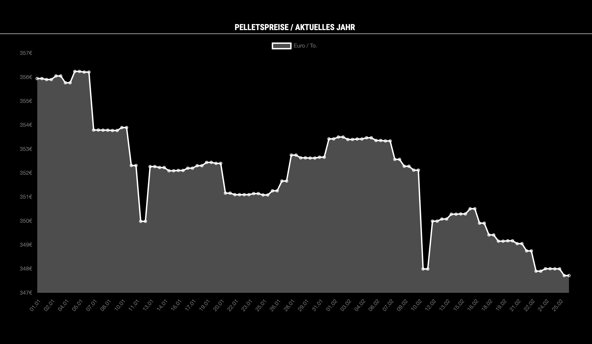

# MMM-Pelletpreise
Chart module for [MagicMirror²](https://github.com/MichMich/MagicMirror). The module displays pellet prices for the current year based on [Chart.js](http://www.chartjs.org/) and the API of [heizpellets24.de](https://www.heizpellets24.de/pelletpreis).

## Screenshot


## Installation

In your terminal, go to your MagicMirror's Module folder:
````
cd ~/MagicMirror/modules
````

Clone this repository:
````
git clone https://github.com/eckonator/MMM-Pelletpreise.git
````

Install dependencies:
````
cd ~/MagicMirror/modules/MMM-Pelletpreise
````

````
npm install
````

Configure the module in your `config.js` file.

## Using the module

To use this module, add it to the modules array in the `config/config.js` file:
````javascript
modules: [
    {
        module: 'MMM-Pelletpreise',
        position: 'middle_center',
        header: 'Pelletspreise / aktuelles Jahr',
        config: {
            country        : 'DE',  // DE | AT | CH
            updateInterval : 86400, // 1 day in seconds
            width          : 1200,   // width in pixel
            height         : 800    // height in pixel
        }
    }
]
````

## Configuration options

The following property can be configured:

| Option      | Description                                            | Default value |
| ------------|--------------------------------------------------------|:-------------:|
| country       | Country for which the prices are to be displayed: DE, AT, CH |   ```DE```    |
| updateInterval      | Update Interval in seconds                             |  ```86400```  |
| width       | Chart width in px.                                     |  ```1200```   |
| height      | Chart height in px.                                    |    ```800```    |


